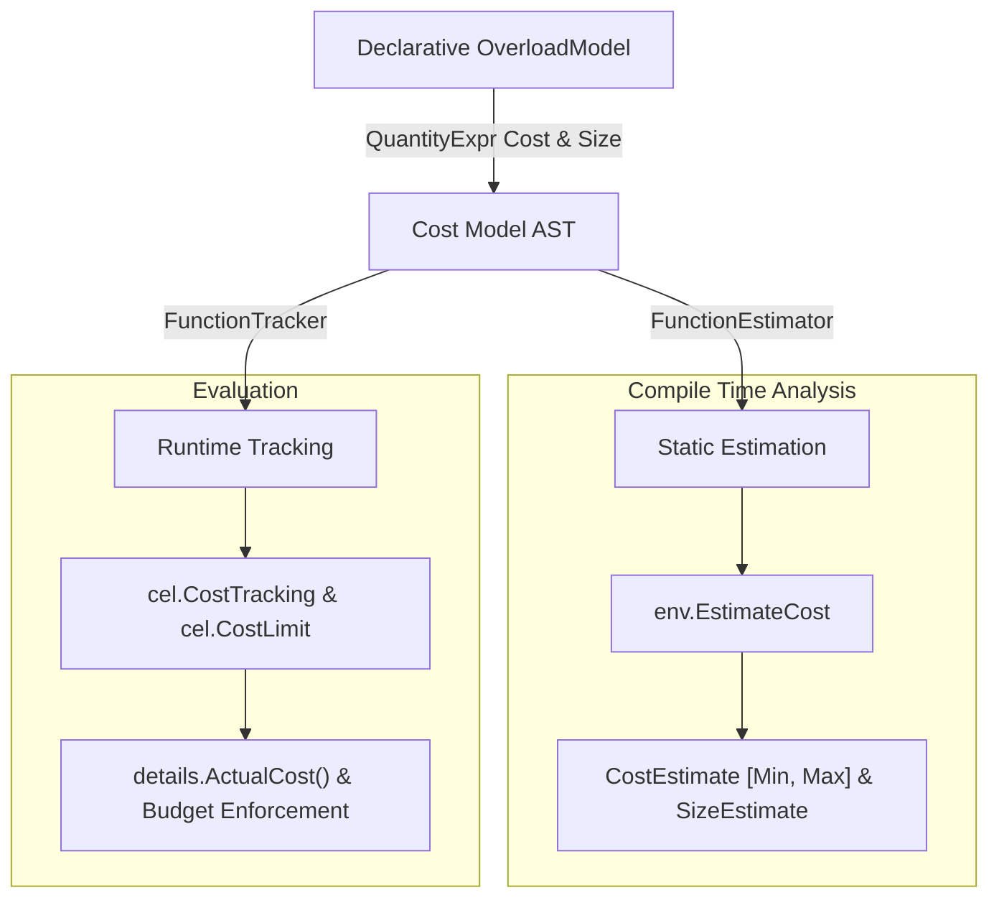

# CEL Cost Model Design & Specification

This document provides a comprehensive specification and usage guide for the
CEL **Cost Model AST** in [cel-go](https://github.com/cel-expr/cel-go). The
Cost Model framework provides a unified, declarative algebraic representation
for both **static cost estimation** and **runtime cost tracking**.

The cost model introduces an AST as a programmatic API for expressing
the algorithm to share during static estimation and runtime cost tracking. While
CEL typically uses expressions to define computation, the cost model is often
specified alongside the function definition and feels more idiomatic. At some
point these cost models may also be expressed as CEL, but for now, they're in
AST form.

---

## 1. Overview & Motivation

CEL expressions execute in diverse environments—from microservices enforcing
admission policies to stream processing engines evaluating millions of events
per second. Protecting compute and memory resources requires two complementary
capabilities:

1. **Static Cost Estimation**: Analyzing an AST before execution to determine
   the theoretical minimum and maximum computational cost ($[Min, Max]$) and
   reject expressions exceeding budget thresholds.
2. **Runtime Cost Tracking**: Measuring the actual computational steps taken
   during expression evaluation and halting execution immediately if a
   configured budget limit is breached.

### The Duality Problem

Prior to the unified Cost Model AST, developers extending CEL with custom
functions had to implement two separate interfaces:
* A static estimator returning `*cost.CallEstimate` (calculating over `AstNode`
  representations and `SizeEstimate` intervals).
* A runtime tracker returning `*uint64` (calculating over concrete `ref.Val`
  inputs and outputs).

This dual-implementation requirement caused code duplication, maintenance
overhead, and subtle inconsistencies between estimated and tracked costs.

### The Unified Cost Model AST Solution

The Cost Model AST in package
[common/cost](https://github.com/cel-expr/cel-go/blob/master/common/cost)
solves this duality. Developers declare the cost and result size equations once
using an algebraic domain-specific expression tree
([`QuantityExpr`](https://github.com/cel-expr/cel-go/blob/master/common/cost/model.go)).
From this single model
([`OverloadModel`](https://github.com/cel-expr/cel-go/blob/master/common/cost/model.go)),
the engine automatically synthesizes:
* A
  [`FunctionEstimator`](https://github.com/cel-expr/cel-go/blob/master/common/cost/estimator.go)
  for compile-time interval analysis.
* A
  [`FunctionTracker`](https://github.com/cel-expr/cel-go/blob/master/common/cost/tracker.go)
  for runtime execution accounting.



### Non-Overflowing Saturating Arithmetic

All cost and size calculations in CEL use unsigned 64-bit integers (`uint64`).
To prevent arithmetic wrapping vulnerabilities:
* `math.MaxUint64` represents an **unbounded** or **unknown** quantity.
* All mathematical operations utilize saturating arithmetic via
  [`common/cost`](https://github.com/cel-expr/cel-go/blob/master/common/cost/cost.go)
  helpers: `SafeAdd` (addition capping at `math.MaxUint64`), `SafeSubtract`
  (subtraction clamping negative differences to `0`), `SafeMultiply`
  (multiplication capping at `math.MaxUint64`), `SafeMultiplyByFactor`
  (floating-point scaling with ceiling rounding), and `SafeCeil`
  (float-to-uint64 ceiling conversion).
* Any sequence of operations on an unbounded input remains safely saturated at
  `math.MaxUint64`.

---

## 2. Core Concepts & Architecture

### Evaluation Contexts

The Cost Model AST evaluates quantity expressions against context interfaces:

* [`TypeContext`](https://github.com/cel-expr/cel-go/blob/master/common/cost/model.go):
  Provides static or runtime type reflection for receiver/target objects and
  positional arguments.
* [`EstimateContext`](https://github.com/cel-expr/cel-go/blob/master/common/cost/model.go):
  Supplies argument size estimates (`Arg(i)`), target size estimates
  (`Target()`), result size estimates (`Result()`), integer literals
  (`ArgValue(i, def)`), and access to the configured
  [`SizingStrategy`](https://github.com/cel-expr/cel-go/blob/master/common/cost/strategy.go).
* [`TrackContext`](https://github.com/cel-expr/cel-go/blob/master/common/cost/model.go):
  Supplies concrete runtime argument sizes (`Arg(i)`), target size
  (`Target()`), result value size (`Result()`), integer argument values
  (`ArgValue(i, def)`), and runtime value sizing.

### Overload Definition

Overload models are configured using functional options:

```go
// Global function overload
cost.Overload(overloadID,
    cost.EvalCost(costExpr),
    cost.ResultSize(sizeExpr),
)

// Receiver / member method overload
cost.MemberOverload(overloadID,
    cost.EvalCost(costExpr),
    cost.ResultSize(sizeExpr),
)
```

### Sizing Strategies

A
[`SizingStrategy`](https://github.com/cel-expr/cel-go/blob/master/common/cost/strategy.go)
governs how container lengths, key sizes, and element sizes are estimated or
observed:
* The
  [`DefaultSizingStrategy`](https://github.com/cel-expr/cel-go/blob/master/common/cost/default_strategy.go)
  inspects inline list/map literals, aggregates element/entry sizes, resolves
  branch unions for ternary conditionals (`cond ? a : b`), and queries field
  path hints (`@items`, `@keys`, `@values`).
* Custom sizing strategies can be attached via
  [`EstimateSizingStrategy`](https://github.com/cel-expr/cel-go/blob/master/common/cost/estimator.go)
  and
  [`TrackerSizingStrategy`](https://github.com/cel-expr/cel-go/blob/master/common/cost/tracker.go).

---

## 3. Cost Model AST Primitives & Combinators Reference

The table below catalogs the AST nodes and helper functions provided by
[`common/cost`](https://github.com/cel-expr/cel-go/blob/master/common/cost/model.go):

| Category | Function / Constructor | Description |
| :--- | :--- | :--- |
| **Constants** | `Const(uint64)` | Fixed constant quantity (e.g. `Const(1)` for $O(1)$ operations). |
| **Arguments** | `Arg(i)` | Size of argument at 0-based index `i`. |
| | `ArgElem(i)` | Element size of container argument at index `i`. |
| | `ArgKey(i)` | Key size of map argument at index `i`. |
| | `IntArg(i, defaultVal)` | Literal / concrete integer value of argument at index `i`. |
| **Receiver / Target** | `Target()` | Size of receiver/target object. |
| | `TargetElem()` | Element size of receiver container. |
| | `TargetKey()` | Key size of receiver map. |
| | `IntTarget(defaultVal)` | Literal / concrete integer value of receiver. |
| **Result** | `Result()` | Size of the evaluated result value. |
| **Arithmetic** | `Sum(terms...)` | Saturating addition $\sum t_i$. |
| | `Sub(lhs, rhs)` | Saturating subtraction $\max(0, lhs - rhs)$. |
| | `Mul(terms...)` | Saturating multiplication $\prod t_i$. |
| | `Square(expr)` | Squared quantity $expr^2$. |
| **Scaling** | `Scale(expr, factor)` | Multiply expression by constant float factor (rounded up). |
| | `ScaleBy(expr, ScaleFn)` | Dynamically scale expression based on type context. |
| | `ArgTypeScale(i, fn)` | Dynamic factor derived from argument type. |
| | `ArgElemTypeScale(i, fn)` | Dynamic factor derived from container argument element type. |
| | `TargetTypeScale(fn)` | Dynamic factor derived from target type. |
| | `TargetElemTypeScale(fn)` | Dynamic factor derived from target element type. |
| **Intervals & Bounds** | `Min(lhs, rhs)` | Minimum quantity between two expressions. |
| | `Max(lhs, rhs)` | Maximum quantity between two expressions. |
| | `Union(terms...)` | Encompassing interval union $[\min(Min_i), \max(Max_i)]$. |
| | `Intersect(terms...)` | Overlapping interval intersection $[\max(Min_i), \min(Max_i)]$. |
| | `Ranged(minExpr, maxExpr)` | Composite range with lower bound from `minExpr` and upper from `maxExpr`. |
| | `AtMost(maxExpr)` | Quantity bounded in $[0, Max(maxExpr)]$. |
| | `AtLeastOneQuantity(expr)` | Quantity guaranteed to be $\ge 1$. |
| **Containers** | `ElemOf(expr)` | Extract element size from composite expression. |
| | `KeyOf(expr)` | Extract key size from composite expression. |
| | `List(lenExpr, elemExpr)` | Construct list size estimate with element size metadata. |
| | `Map(sizeExpr, keyExpr, valExpr)` | Construct map size estimate with key and value size metadata. |
| **Standard Macros** | `StringScan(expr)` | Shorthand for `Scale(expr, 0.1)`. |
| | `CompareCost(lhs, rhs)` | Comparison cost of two values ($O(1)$ scalars, min-length scaled strings, recursive containers). |
| | `ListAlloc(elemCount, factor)` | Base allocation cost ($10$) plus scaled element count. |
| | `Traversal(expr, factor, alloc)` | Traversal cost with optional fixed allocation cost. |

---

## 4. Cost Model Examples & Use Cases

The following catalog demonstrates distinct use cases exercising all features
of the Cost Model AST.

---

### Constant Time Container Indexing

* **CEL Expression**: `items[0]` or `lookup[key]`
* **Complexity**: $O(1)$ evaluation cost; result size inherits container
  element size.
* **Cost Model AST**:
```go
cost.Overload(overloads.IndexList,
    cost.EvalCost(cost.Const(1)),
    cost.ResultSize(cost.ArgElem(0)),
)
```
* **Estimation Behavior**: Cost is fixed at $1$; result size matches the
  element size estimate of `items`.
* **Tracking Behavior**: Incurs $1$ unit of runtime cost.

---

### Linear String Prefix / Suffix Search

* **CEL Expression**: `str.startsWith(prefix)` or `str.endsWith(suffix)`
* **Complexity**: $O(k)$ where $k$ is the prefix/suffix string length.
* **Cost Model AST**:
```go
cost.MemberOverload(overloads.StartsWithString,
    cost.EvalCost(cost.Scale(cost.Arg(0), cost.StringTraversalCostFactor)),
)
```
* **Estimation Behavior**: Scales prefix length estimate by `0.1` (rounded up).
* **Tracking Behavior**: Multiplies actual prefix byte length by `0.1`.

---

### String-to-Bytes Conversion with UTF-8 Expansion Bounds

* **CEL Expression**: `bytes(str)`
* **Complexity**: $O(n)$ traversal cost; resulting byte size expands between
  $1\times$ (ASCII) and $4\times$ (multi-byte UTF-8).
* **Cost Model AST**:
```go
cost.Overload(overloads.StringToBytes,
    cost.EvalCost(cost.Scale(cost.Arg(0), cost.StringTraversalCostFactor)),
    cost.ResultSize(cost.Ranged(cost.Arg(0), cost.Scale(cost.Arg(0), 4.0))),
)
```
* **Estimation Behavior**: If `str` length is $[10, 20]$, byte result size
  estimate is $[10, 80]$.
* **Tracking Behavior**: Incurs traversal cost based on string length; tracks
  byte length.

---

### Bytes-to-String Conversion with Contraction Bounds

* **CEL Expression**: `string(bytesData)`
* **Complexity**: $O(n)$ traversal cost; string character count is bounded
  between $0.25\times$ and $1.0\times$ of byte length.
* **Cost Model AST**:
```go
cost.Overload(overloads.BytesToString,
    cost.EvalCost(cost.Scale(cost.Arg(0), cost.StringTraversalCostFactor)),
    cost.ResultSize(cost.Ranged(cost.Scale(cost.Arg(0), 0.25), cost.Arg(0))),
)
```
* **Estimation Behavior**: A byte slice of length $100$ produces a string size
  estimate of $[25, 100]$.
* **Tracking Behavior**: Runtime cost proportional to scanned byte slice.

---

### String Quoting and Escaping with Delimiters

* **CEL Expression**: `str.quote()` (or `ext.quote(str)`)
* **Complexity**: $O(n)$ scanning; result size adds $2$ delimiter quotes plus
  up to $2\times$ character expansion from escaping.
* **Cost Model AST**:
```go
cost.Overload(overloads.ExtQuoteString,
    cost.EvalCost(cost.Scale(cost.Arg(0), cost.StringTraversalCostFactor)),
    cost.ResultSize(cost.Ranged(
        cost.Sum(cost.Arg(0), cost.Const(2)),
        cost.Sum(cost.Scale(cost.Arg(0), 2.0), cost.Const(2)),
    )),
)
```
* **Estimation Behavior**: For string of length $[5, 10]$, result size estimate
  is $[7, 22]$.
* **Tracking Behavior**: Charge traversal cost; records actual formatted string
  length.

---

### String & Byte Concatenation

* **CEL Expression**: `s1 + s2`
* **Complexity**: $O(m + n)$ memory allocation and copying; result size is
  exactly $m + n$.
* **Cost Model AST**:
```go
cost.Overload(overloads.AddString,
    cost.EvalCost(cost.Scale(
        cost.Sum(cost.Arg(0), cost.Arg(1)),
        cost.StringTraversalCostFactor,
    )),
    cost.ResultSize(cost.Sum(cost.Arg(0), cost.Arg(1))),
)
```
* **Estimation Behavior**: Sums argument lengths for cost scaling and assigns
  $[Min_1 + Min_2, Max_1 + Max_2]$ to result size.
* **Tracking Behavior**: Accurate runtime addition of sizes.

---

### O(1) Shallow List Concatenation

* **CEL Expression**: `list1 + list2`
* **Complexity**: $O(1)$ header creation using persistent slices; result size
  is sum of lengths.
* **Cost Model AST**:
```go
cost.Overload(overloads.AddList,
    cost.EvalCost(cost.Const(1)),
    cost.ResultSize(cost.Sum(cost.Arg(0), cost.Arg(1))),
)
```
* **Estimation Behavior**: Fixed cost of $1$; element count tracked as sum of
  list sizes.
* **Tracking Behavior**: Constant $1$ execution cost.

---

### Linear Collection Membership Search

* **CEL Expression**: `item in list`
* **Complexity**: $O(n)$ scanning of list elements.
* **Cost Model AST**:
```go
cost.Overload(overloads.InList,
    cost.EvalCost(cost.Arg(1)),
)
```
* **Estimation Behavior**: Maximum cost equals the maximum estimated length of
  the list argument.
* **Tracking Behavior**: Actual cost equals the runtime size of the list.

---

### Lexicographical String & Byte Comparisons

* **CEL Expression**: `s1 < s2`, `s1 >= s2`, `b1 == b2`
* **Complexity**: $O(\min(m, n))$ string/byte comparison bounded by the shorter
  input.
* **Cost Model AST**:
```go
cost.Overload(overloads.LessString,
    cost.EvalCost(cost.Scale(
        cost.Min(cost.Arg(0), cost.Arg(1)),
        cost.StringTraversalCostFactor,
    )),
)
```
* **Estimation Behavior**: Takes the minimum upper bound between argument $0$
  and argument $1$.
* **Tracking Behavior**: Charges $\min(len(s1), len(s2)) \times 0.1$.

---

### Substring Containment

* **CEL Expression**: `str.contains(substr)`
* **Complexity**: $O(n \times m)$ worst-case search.
* **Cost Model AST**:
```go
cost.MemberOverload(overloads.ContainsString,
    cost.EvalCost(cost.Mul(
        cost.Scale(cost.Target(), cost.StringTraversalCostFactor),
        cost.Scale(cost.Arg(0), cost.StringTraversalCostFactor),
    )),
)
```
* **Estimation Behavior**: Multiplies scaled target length by scaled search
  string length.
* **Tracking Behavior**: Multiplies actual lengths scaled by string traversal
  cost factor.

---

### Regular Expression Pattern Matching

* **CEL Expression**: `text.matches(r'^[a-z]+$')`
* **Complexity**: $O(n \times m)$ proportional to input text length and
  compiled regex size.
* **Cost Model AST**:
```go
cost.MemberOverload(overloads.MatchesString,
    cost.EvalCost(cost.Mul(
        cost.Scale(
            cost.Sum(cost.Target(), cost.Const(1)),
            cost.StringTraversalCostFactor,
        ),
        cost.Scale(cost.Arg(0), cost.RegexStringLengthCostFactor),
    )),
)
```
* **Estimation Behavior**: Evaluates regex length with factor $0.25$ against
  text length with factor $0.1$.
* **Tracking Behavior**: Tracks concrete runtime sizes of target string and
  regex pattern.

---

### List Slicing with Literal Integer Bounds

* **CEL Expression**: `items.slice(2, 8)`
* **Complexity**: $O(1)$ slicing overhead; result size bounded by integer
  argument delta.
* **Cost Model AST**:
```go
cost.MemberOverload("list_slice_int_int",
    cost.EvalCost(cost.Const(1)),
    // Result size is bounded by [0, end - start] when literal integer
    // indices are present
    cost.ResultSize(cost.AtMost(
        cost.Sub(cost.IntArg(1, math.MaxUint64), cost.IntArg(0, 0)),
    )),
)
```
* **Estimation Behavior**: If arguments are literal integers $2$ and $8$,
  result size is estimated as $[0, 6]$.
* **Tracking Behavior**: Extracts runtime integer arguments, computing
  $8 - 2 = 6$.

---

### String Repetition with Scalar Multiplier

* **CEL Expression**: `str.repeat(count)`
* **Complexity**: $O(n \times count)$ string construction; result size is
  product of length and count.
* **Cost Model AST**:
```go
cost.MemberOverload("string_repeat_int",
    cost.EvalCost(cost.Scale(
        cost.Mul(cost.Target(), cost.IntArg(0, 1)),
        cost.StringTraversalCostFactor,
    )),
    cost.ResultSize(cost.Mul(cost.Target(), cost.IntArg(0, 1))),
)
```
* **Estimation Behavior**: Multiplies target size interval by literal
  multiplier argument.
* **Tracking Behavior**: Multiplies target string length by dynamic runtime
  integer parameter.

---

### String Splitting into Substrings

* **CEL Expression**: `text.split(",")`
* **Complexity**: $O(n)$ scanning; result list length is at most $n + 1$, each
  element size at most $n$.
* **Cost Model AST**:
```go
cost.MemberOverload("string_split_string",
    cost.EvalCost(cost.StringScan(cost.Target())),
    cost.ResultSize(cost.List(
        cost.AtMost(cost.Sum(cost.Target(), cost.Const(1))),
        cost.AtMost(cost.Target()),
    )),
)
```
* **Estimation Behavior**: Produces composite `SizeEstimate` for list where
  `Elem` represents substring size bounded by `Target()`.
* **Tracking Behavior**: Runtime size matches the count of split tokens.

---

### Nested List Flattening

* **CEL Expression**: `matrix.flatten()`
* **Complexity**: $O(N \times M)$ element traversal; output list length is
  $N \times M$, element size is element of nested list.
* **Cost Model AST**:
```go
cost.MemberOverload("list_flatten",
    cost.EvalCost(cost.ListAlloc(
        cost.Mul(cost.Target(), cost.TargetElem()),
        0.1,
    )),
    cost.ResultSize(cost.List(
        cost.Mul(cost.Target(), cost.TargetElem()),
        cost.ElemOf(cost.TargetElem()),
    )),
)
```
* **Estimation Behavior**: Multiplies outer list size by inner list element
  size.
* **Tracking Behavior**: Accurately accounts for total flattened elements and
  base allocation.

---

### Map Key / Value Projection

* **CEL Expression**: `userMap.keys()` or `userMap.values()`
* **Complexity**: $O(n)$ list allocation; result list length equals map size,
  element size equals key/value size.
* **Cost Model AST**:
```go
// map.keys()
cost.MemberOverload("map_keys",
    cost.EvalCost(cost.ListAlloc(cost.Target(), 0.1)),
    cost.ResultSize(cost.List(cost.Target(), cost.TargetKey())),
)

// map.values()
cost.MemberOverload("map_values",
    cost.EvalCost(cost.ListAlloc(cost.Target(), 0.1)),
    cost.ResultSize(cost.List(cost.Target(), cost.TargetElem())),
)
```
* **Estimation Behavior**: Returns a list size estimate whose length matches
  map size and whose `Elem` matches map `Key` or `Elem`.
* **Tracking Behavior**: Runtime cost reflects map entry traversal and
  allocation.

---

### Pair Zipping into Composite Map

* **CEL Expression**: `zipToMap(keys, values)`
* **Complexity**: $O(\min(len_1, len_2))$ map allocation; composite map size
  bounded by smaller input.
* **Cost Model AST**:
```go
cost.Overload("zip_to_map_list_list",
    cost.EvalCost(cost.Sum(
        cost.Const(cost.MapCreateBaseCost),
        cost.Scale(cost.Min(cost.Arg(0), cost.Arg(1)), 1.0),
    )),
    cost.ResultSize(cost.Map(
        cost.Min(cost.Arg(0), cost.Arg(1)),
        cost.ArgElem(0),
        cost.ArgElem(1),
    )),
)
```
* **Estimation Behavior**: Constructs composite map `SizeEstimate` carrying key
  size from argument $0$ and value size from argument $1$.
* **Tracking Behavior**: Uses minimum runtime length of both lists plus map
  creation base cost.

---

### Dynamic Type-Aware Serialization

* **CEL Expression**: `encode(payload)`
* **Complexity**: Varies by argument type (e.g. primitives are $O(1)$,
  strings/maps require higher per-byte cost).
* **Cost Model AST**:
```go
cost.Overload("custom_encode",
    cost.EvalCost(cost.ScaleBy(
        cost.Arg(0),
        cost.ArgTypeScale(0, func(t *types.Type) float64 {
            if t == nil {
                return 1.0
            }
            switch t.Kind() {
            case types.StringKind, types.BytesKind:
                return 0.5
            case types.MapKind, types.StructKind:
                return 2.0
            default:
                return 0.1
            }
        }),
    )),
    cost.ResultSize(cost.Scale(cost.Arg(0), 1.5)),
)
```
* **Estimation Behavior**: Inspects static type from AST; scales size by the
  type-specific factor.
* **Tracking Behavior**: Inspects dynamic type of runtime value and applies
  corresponding scale factor.

---

### Container Element Type-Dependent Hashing

* **CEL Expression**: `items.hashList()`
* **Complexity**: Traversal cost factor depends on whether list elements are
  heavy (e.g. strings) or light (integers).
* **Cost Model AST**:
```go
cost.MemberOverload("list_hash",
    cost.EvalCost(cost.ScaleBy(
        cost.Target(),
        cost.TargetElemTypeScale(func(elemType *types.Type) float64 {
            if elemType == types.StringType || elemType == types.BytesKind {
                return 0.8
            }
            return 0.2
        }),
    )),
    cost.ResultSize(cost.Const(32)), // 32-byte digest
)
```
* **Estimation Behavior**: Extracts type parameter $T$ from `list(T)` and
  applies appropriate multiplier.
* **Tracking Behavior**: Resolves target container element type at runtime.

---

### Cartesian Product / Cross Join

* **CEL Expression**: `list1.cross(list2)`
* **Complexity**: $O(N \times M)$ quadratic generation of paired tuples.
* **Cost Model AST**:
```go
cost.MemberOverload("list_cross_list",
    cost.EvalCost(cost.ListAlloc(cost.Mul(cost.Target(), cost.Arg(0)), 0.5)),
    cost.ResultSize(cost.List(
        cost.Mul(cost.Target(), cost.Arg(0)),
        cost.Sum(cost.TargetElem(), cost.ArgElem(0)),
    )),
)
```
* **Estimation Behavior**: Multiplies sizes
  $[Min_1 \times Min_2, Max_1 \times Max_2]$; element size is sum of individual
  element sizes.
* **Tracking Behavior**: Accurately computes $len(list1) \times len(list2)$.

---

### Conditional Branch Union & Short-Circuiting

* **CEL Expression**: `cond ? exprA : exprB`
* **Complexity**: Branch selection has $0$ additional cost; result size is
  union of both branches.
* **Cost Model AST**:
```go
cost.Overload(overloads.Conditional,
    cost.EvalCost(cost.Const(0)),
    cost.ResultSize(cost.Union(cost.Arg(1), cost.Arg(2))),
)
```
* **Estimation Behavior**: The result size interval is
  $[\min(Min_A, Min_B), \max(Max_A, Max_B)]$.
* **Tracking Behavior**: Only the evaluated branch is charged at runtime.

---

### Block-Padded Cryptographic Encryption

* **CEL Expression**: `encrypt(plainBytes, key)`
* **Complexity**: Linear encryption cost; output size padded to nearest 16-byte
  AES block boundary.
* **Cost Model AST**:
```go
cost.Overload("crypto_encrypt_bytes_bytes",
    cost.EvalCost(cost.Scale(cost.Arg(0), 1.2)),
    cost.ResultSize(cost.Sum(
        cost.Arg(0),
        cost.Const(16), // Max PKCS#7 padding
    )),
)
```
* **Estimation Behavior**: Estimates encryption cost with factor $1.2$ and
  bounds result size to $len + 16$.
* **Tracking Behavior**: Evaluates actual bytes processed.

---

## 5. Practical Integration Guide

### Step 1: Registering Overload Models in Custom Extensions

To register custom cost models in a CEL environment, construct `OverloadModel`
definitions and provide them to `cel.CostTracking` and `cel.CostEstimator`:

```go
package myext

import (
    "cel.dev/cel-go/cel"
    "cel.dev/cel-go/common/cost"
    "cel.dev/cel-go/common/types"
    "cel.dev/cel-go/common/types/ref"
)

var MyCustomOverloads = []cost.OverloadModel{
    cost.MemberOverload("string_reverse",
        cost.EvalCost(cost.StringScan(cost.Target())),
        cost.ResultSize(cost.Target()),
    ),
}

func ExtensionOptions() []cel.EnvOption {
    // Return environment options binding functions and cost models
    return []cel.EnvOption{
        cel.Function("reverse",
            cel.MemberOverload("string_reverse",
                []*cel.Type{cel.StringType},
                cel.StringType,
                cel.UnaryBinding(func(val ref.Val) ref.Val {
                    s := val.(types.String)
                    runes := []rune(string(s))
                    for i, j := 0, len(runes)-1; i < j; i, j = i+1, j-1 {
                        runes[i], runes[j] = runes[j], runes[i]
                    }
                    return types.String(string(runes))
                }),
            ),
        ),
    }
}
```

### Step 2: Static Cost Estimation with Size Hints

Use
[`env.EstimateCost`](https://github.com/cel-expr/cel-go/blob/master/cel/env.go)
to compute estimated cost intervals:

```go
type staticEstimator struct {
    hints map[string]uint64
}

func (e staticEstimator) EstimateSize(node cost.AstNode) *cost.SizeEstimate {
    if node == nil || len(node.Path()) == 0 {
        return nil
    }
    pathKey := strings.Join(node.Path(), ".")
    if size, ok := e.hints[pathKey]; ok {
        sz := cost.FixedSizeEstimate(size)
        return &sz
    }
    return nil
}

func (staticEstimator) EstimateCallCost(
    function, overloadID string,
    target *cost.AstNode,
    args []cost.AstNode,
) *cost.CallEstimate {
    return nil // Use standard and custom OverloadModels
}

func Estimate(env *cel.Env, ast *cel.Ast) (cost.CostEstimate, error) {
    estimator := staticEstimator{
        hints: map[string]uint64{
            "request.auth.claims": 10,
            "request.auth.claims.@keys": 15,
            "request.auth.claims.@values": 30,
        },
    }
    
    // Pass custom overload estimators if needed
    var opts []cost.CostOption
    for _, m := range MyCustomOverloads {
        opts = append(opts,
            cost.OverloadCostEstimate(m.ID, m.FunctionEstimator()))
    }
    
    return env.EstimateCost(ast, estimator, opts...)
}
```

### Step 3: Runtime Cost Tracking & Budget Enforcement

Enforce hard computational limits during program execution:

```go
func ExecuteWithBudget(
    env *cel.Env,
    ast *cel.Ast,
    input map[string]any,
    budgetLimit uint64,
) (ref.Val, *cel.EvalDetails, error) {
    var trackerOpts []cost.TrackerOption
    for _, m := range MyCustomOverloads {
        trackerOpts = append(trackerOpts,
            cost.OverloadTracker(m.ID, m.FunctionTracker()))
    }

    prg, err := env.Program(ast,
        cel.CostLimit(budgetLimit),
        cel.CostTracking(nil, trackerOpts...),
    )
    if err != nil {
        return nil, nil, err
    }

    val, details, err := prg.Eval(input)
    return val, details, err
}
```

---

## 6. Best Practices

1. **Leverage Standard Macros**: Use
   [`StringScan`](https://github.com/cel-expr/cel-go/blob/master/common/cost/model.go)
   and
   [`ListAlloc`](https://github.com/cel-expr/cel-go/blob/master/common/cost/model.go)
   rather than manual arithmetic to ensure consistency across the codebase.
2. **Propagate Element and Key Sizes**: When a function produces a container
   (`list` or `map`), always specify
   [`ResultSize`](https://github.com/cel-expr/cel-go/blob/master/common/cost/model.go)
   with
   [`List`](https://github.com/cel-expr/cel-go/blob/master/common/cost/model.go)
   or
   [`Map`](https://github.com/cel-expr/cel-go/blob/master/common/cost/model.go)
   descriptors so downstream operations (e.g. indexing, comprehensions) can
   accurately estimate size without falling back to unbounded estimates.
3. **Use Subpath Sizing Hints**: Structure size hints using CEL path
   conventions (`variable`, `variable.field`, `variable.@items`,
   `variable.@keys`, `variable.@values`) to enable automatic deep container
   sizing.
4. **Always Rely on Saturating Arithmetic**: Never bypass the `cost.Safe*`
   helpers in custom sizing strategies or quantity expressions to protect
   against overflow vulnerabilities.
